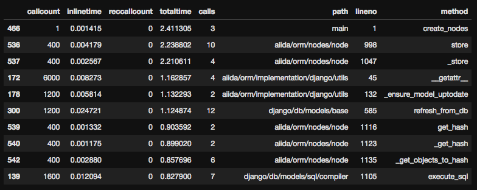
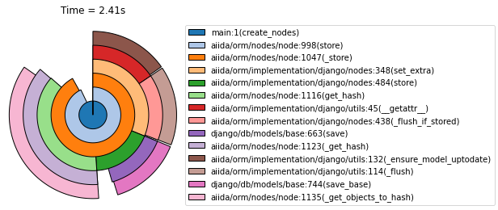
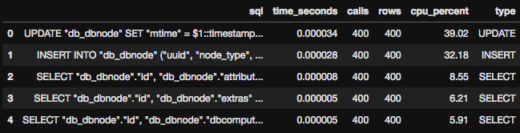
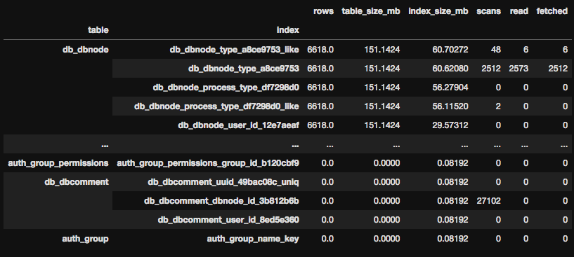
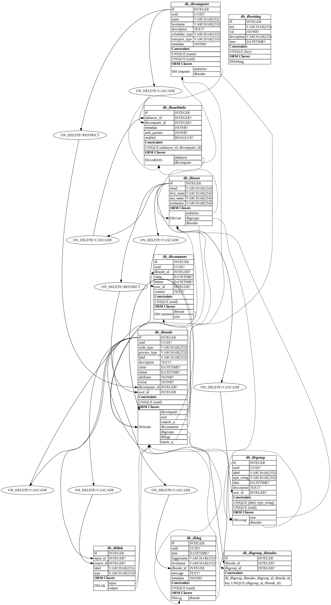

# aiida-profiling

A small package with code helpful for profiling the aiida code and database. In particular, the functions are written for easy use in Jupyter Notebooks.

## Example

```python
from aiida_perf.profiling import Profile, ProfileAnalyzer, plot_sunburst
from aiida_perf import db_stats

def create_nodes(n=400):
    for i in range(n):
        node = orm.Data()
        node.store()

with db_stats.PostGresAnalysis() as db:
    with Profile() as pr:
        create_nodes()

prof = ProfileAnalyzer(pr)
prof.save("save.profile")
prof.df.head(10)
```



`prof` provides a `pandas DataFrame` and `nxgraph.DiGraph` for analysing the profile chain. These are used to e.g. create visualisations from a root node.

```python
root = prof.get_root()
ax = plot_sunburst(
    prof,
    depth=6,
    max_rows=20,
    min_rel=0.1, 
    add_total_time=True
)
```



The following uses the [pg_stat_statements](https://dzone.com/articles/the-most-useful-postgres-extension-pg-stat-stateme) extension to record query statistice at the PostgreSQL level (it requires activating in `postgres.conf`). The context manager above resets the statistics before the code is run.

```python
db.query_stats.head()
```



`db_stats` contains a number of raw PostgresSQL,
queries, with conversions to pandas DataFrames.

```python
db_stats.indices_stats_df(sort_size=True)
```



The following code provides a UML for any SQLAlchemy ORM Model.

```python
from aiida.backends.sqlalchemy import models
from aiida.backends.sqlalchemy.models.base import Base
db_struct.import_submodules(models)
g = db_struct.visualise_sqla(Base)
```

